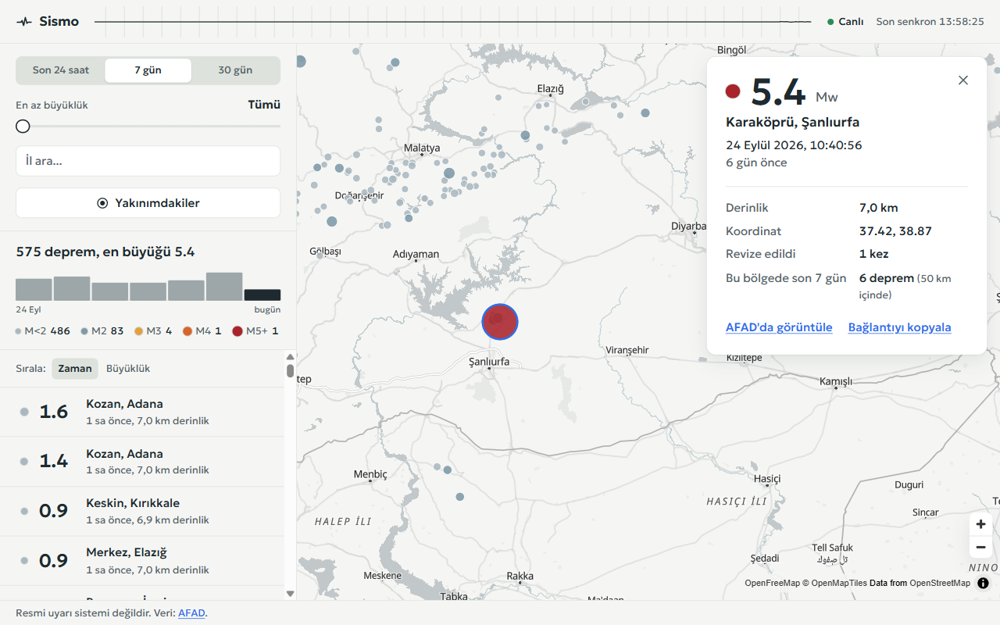

# Sismo

Türkiye'deki depremleri AFAD verisiyle harita üzerinde canlı gösteren, filtrelenebilir, mobilde rahat kullanılan bir uygulama.

> Bu uygulama resmi bir uyarı sistemi değildir. Resmi bilgi için [AFAD](https://deprem.afad.gov.tr).

**Canlı demo:** `{CANLI_DEMO_URL}` · **API dokümanı:** `{API_URL}/docs`



## Ne yapıyor?

- AFAD'dan her 60 saniyede son 3 saati çeker, kendi veritabanına yazar, yeni ve revize edilen depremleri WebSocket (SignalR) ile açık sayfalara iter. Sayfa yenilemeden en geç ~90 saniyede yeni deprem görünür.
- Zaman aralığı (24 saat / 7 gün / 30 gün), en az büyüklük, il ve "yakınımdakiler" (tarayıcı konumu ya da haritada uzun basılan nokta) filtreleri. Tüm filtre durumu URL'de; link kopyalanınca aynı görünüm açılır.
- Harita görsel bir tamamlayıcı: tüm bilgi listede de var, liste klavyeyle (ok tuşları) gezilebiliyor, M ≥ 3.0 yeni depremler ekran okuyucuya `aria-live` ile duyuruluyor.
- Üst çubukta sismograf çizgisi: normalde neredeyse düz, yeni deprem gelince büyüklüğüyle orantılı tek bir sapma çiziyor. Ses, titreşim, yanıp sönen kırmızı yok.

## Mimari

```
 AFAD apiv2 ──(60 sn'de bir)──▶ SyncService ──upsert──▶ SQLite (EF Core)
                                     │                        │
                                     │ yeni/güncellenen       │ sorgu
                                     ▼                        ▼
                               SignalR Hub ◀────────── Minimal API (REST)
                                     │                        │
                                     └──── WebSocket ───┐  ┌── HTTP ──┘
                                                        ▼  ▼
                                                   React (web/)
```

Frontend AFAD'a hiç gitmez; tüm veri kendi API'mizden geçer (önbellek, filtreleme, CORS derdi yok, AFAD'a gereksiz yük yok).

| Katman | Seçim |
|---|---|
| Backend | ASP.NET Core 10 Minimal API, C# |
| Veri | EF Core + SQLite |
| Arka plan işi | `BackgroundService` + `PeriodicTimer` |
| AFAD istemcisi | Typed `HttpClient` + `Microsoft.Extensions.Http.Resilience` (retry, timeout, circuit breaker) |
| Gerçek zamanlı | SignalR |
| API dokümanı | OpenAPI + Scalar (`/docs`) |
| Test | xUnit + `WebApplicationFactory` (bellek içi SQLite) |
| Frontend | React 19 + Vite + TypeScript (strict) |
| Harita | MapLibre GL JS + OpenFreeMap vektör karoları (anahtarsız) |
| Veri çekme | TanStack Query |
| Stil | CSS Modules + `tokens.css`; grafikler el yazımı SVG |

## Karşılaştığım problemler

**AFAD'ın davranışını tahmin etmek yerine ölçtüm.** İlk iş gerçek bir istek atıp yanıtı [`api/docs/afad-sample.json`](api/docs/afad-sample.json) olarak kaydettim; eşleyici ve testleri bu örneğe göre yazıldı. Çıkanlar:

- **Tarihler ofsetsiz ama UTC.** `"2026-09-30T09:37:06"` Türkiye saati gibi duruyor; canlı akıştaki en son olay ve `lastUpdateDate` şimdiki UTC zamanının dakikalar gerisindeydi. Veritabanında her şey UTC, ekranda `Europe/Istanbul`.
- **`limit`, `orderby`'dan önce uygulanıyor.** `orderby=timedesc&limit=5` en *eski* 5 kaydı ters sırayla döndürüyor. `limit` hiç kullanılmıyor; 30 gün (~2.600 kayıt) zaten tek istekte geliyor.
- **Sayılar string olarak geliyor** (`"magnitude": "1.6"`), bazı alanlar `null`. DTO her şeyi nullable string tutuyor, eşleyici `InvariantCulture` ile ayrıştırıyor, zorunlu alanı eksik kaydı atlıyor.
- **Belgelenen adres 302 ile yönlendiriyor.** `deprem.afad.gov.tr/apiv2` → `servisnet.afad.gov.tr/apigateway/deprem/apiv2`; her turda iki istek olmasın diye doğrudan ikincisi kullanılıyor.

**Revize edilen depremler.** AFAD bir depremin büyüklüğünü ya da konumunu sonradan düzeltebiliyor (`isEventUpdate`). Bu yüzden senkron yalnızca yeni kayıtları değil, son 3 saatlik pencereyi her dakika yeniden çekiyor. Her kayıt için: yoksa ekle (`QuakeAdded`), büyüklük/konum değiştiyse güncelle ve `Revision++` (`QuakeUpdated`), aynıysa dokunma. İstemci güncellenen kaydı önbellekte yerinde değiştiriyor; revizyon depremi aktif filtrenin dışına çıkarırsa listeden de düşüyor.

**Yarıçap sorgusu iki aşamalı.** SQLite'ta coğrafi indeks yok. Önce yarıçapı kesin kapsayan bir enlem/boylam kutusuyla SQL'de daraltıyorum (indeksli, ucuz), sonra kalan az sayıda kayıtta Haversine ile kesin mesafeyi C#'ta hesaplayıp `distanceKm` ekliyorum. Kutunun gerçekten tüm çemberi kapsadığı testte 5°'lik adımlarla doğrulanıyor.

**Türkçe büyük/küçük harf.** SQLite'ın `lower()` fonksiyonu yalnızca ASCII biliyor; `izmir` ≠ `İzmir`. İl filtresi `tr-TR` kültürüyle bellekte uygulanıyor (veri 30 günle sınırlı olduğu için maliyetsiz).

**Önbellek + CORS.** Liste ve istatistik 30 sn output cache'te; yeni deprem gelince etiketle temizleniyor. Önbellek anahtarı `Origin` başlığına göre de ayrışıyor, yoksa bir kaynağa verilen CORS başlığı başka bir kaynağa önbellekten dönebilirdi.

**İlk doldurma yayınlanmıyor.** Boş veritabanında 30 günlük doldurma binlerce `QuakeAdded` mesajı demek; bu turda yayın yapılmıyor, istemciler zaten REST'ten yüklüyor.

**Gerçek zamanlı akışta kayıp yok.** SignalR koparsa üst çubuk `○ Bağlantı yok` gösteriyor, üstel geri çekilmeyle sonsuza dek yeniden bağlanıyor ve bağlanınca kaçırılmış olabilecek veriyi REST'ten tazeliyor. Sismograf ve harita halkası React state'i yerine küçük bir olay kanalı dinliyor; böylece aynı anda gelen iki deprem React'in toplu güncellemesinde birbirini ezmiyor.

**MapLibre 6 + Vite.** MapLibre 6 worker dosyasını kendi modülünün yanında arıyor; Vite paketleyince bu yol bozuluyor. Worker'ı `?worker&url` ile Vite'a ayrıca paketletip `setWorkerUrl` ile veriyorum; geliştirmede de MapLibre ön-paketlemeden çıkarıldı. Harita ~1 MB olduğu için `React.lazy` ile ayrı parçada; liste ve filtreler haritayı beklemiyor.

Diğer küçük kararlar [`DECISIONS.md`](DECISIONS.md)'de tek satırlık notlar halinde.

## Yerelde çalıştırma

Gerekenler: .NET 10 SDK, Node 24.

```bash
dotnet run --project api/Sismo.Api
```

API `http://localhost:5080`'de açılır, ilk açılışta son 30 günü AFAD'dan doldurur (birkaç saniye). Doküman: `http://localhost:5080/docs`.

```bash
npm --prefix web install
```

```bash
npm --prefix web run dev
```

Web `http://localhost:5173`'te açılır. Geliştirmede Vite `/api`, `/health` ve `/hubs` isteklerini API'ye yönlendirir (farklı bir adres için `SISMO_API` ortam değişkeni).

Canlı akışı AFAD'ı beklemeden denemek için (yalnızca Development ortamında):

```bash
curl -X POST "http://localhost:5080/dev/simulate-quake?mag=3.8"
```

## Testler

```bash
dotnet test api/Sismo.slnx
```

- `AfadMapperTests`: gerçek örnek doğru eşleniyor, eksik alanlar çökertmiyor, saat dilimi UTC.
- `HaversineTests`: bilinen şehir çiftleri ±1 km, sınırlayıcı kutu çemberi kapsıyor.
- `SyncServiceTests`: ilk doldurma, ekleme, revizyon, değişmeyen kayıt, AFAD hatası, 30 günlük temizlik.
- `EarthquakesEndpointTests`: filtreler, sınır değerler, 400/404 `ProblemDetails`, istatistikler, CORS.

Frontend: `npm --prefix web run lint` ve `npm --prefix web run build`. CI (GitHub Actions) üçünü de ve Docker imajını her push'ta çalıştırır.

## Yayına alma

**API (Fly.io, önerilen):** `api/Sismo.Api/fly.toml` hazır. SQLite kalıcı bir volume'da durur, makine uykuya geçmez (senkron döngüsü sürekli çalışmalı).

```bash
fly volumes create sismo_data --size 1 --region otp
```

```bash
fly secrets set Cors__Origins__0=https://SENIN-ALAN-ADIN.vercel.app
```

```bash
fly deploy
```

**API (Render):** kökteki `render.yaml`. Ücretsiz planda disk olmadığı için her yeniden başlatmada 30 gün tek istekle yeniden doldurulur; plan boşta uyuduğu için canlı akış duraklar.

**Web (Vercel):** Root Directory `web`, ortam değişkeni `VITE_API_URL=https://sismo-api.fly.dev`.

Yayından sonra `Afad:UserAgent` ayarına repo adresi eklenebilir: `Sismo/1.0 (+https://github.com/...)`.

## API

| Metot | Yol | Açıklama |
|---|---|---|
| GET | `/api/earthquakes` | `range` (`24h`/`7d`/`30d`), `minMag`, `province`, `lat`+`lon`+`radiusKm` (≤ 500), `sort` (`time`/`magnitude`), `limit` (≤ 2000) |
| GET | `/api/earthquakes/{id}` | Tek deprem |
| GET | `/api/stats` | Toplam, en büyük, büyüklük dağılımı, saatlik/günlük seri, ilk 5 il (liste ile aynı filtreler) |
| GET | `/api/provinces` | Veride geçen iller |
| GET | `/health` | Durum, son senkron, kayıt sayısı |
| WS | `/hubs/quakes` | `QuakeAdded`, `QuakeUpdated` |

IP başına dakikada 60 istek; liste ve istatistik 30 sn önbellekli.

## Kişisel notlar

{KİŞİSEL NOTLAR}
